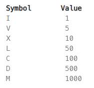

## LC13 Roman to Integer

* Roman numerals are represented by seven different symbols: I, V, X, L, C, D and M. <br />



* For example, 2 is written as II in Roman numeral, just two ones added together. 12 is written as XII, which is simply X + II. The number 27 is written as XXVII, which is XX + V + II.

* Given a roman numeral, convert it to an integer.

### Example 1:

* Input: s = "III"
* Output: 3
* Explanation: III = 3.


### Solution:

* **Iterative Mapping Strategy**: Use a hash map (or a switch-case/simple array) to store Roman numeral values. Iterate through the string and compare the current character's value with the next one.
* **Subtractive Rule Logic**: If the current value is smaller than the value of the next character (e.g., IV, IX, XL), subtract the current value from the total; otherwise, add it.
* **Optimal Complexity**: The solution runs in **O(N) time complexity**, where N is the length of the string, and **O(1) space complexity** since the mapping of Roman numerals is constant and finite.


```cpp title="roman to integer.cpp"
class Solution {
public:
    int romanToInt(string s) {
        // Step 1: Initialize the value mapping
        unordered_map<char, int> romanMap = {
            {'I', 1}, {'V', 5}, {'X', 10}, {'L', 50},
            {'C', 100}, {'D', 500}, {'M', 1000}
        };
        
        int total = 0;
        int n = s.length();

        // Step 2: Iterate through the string
        for (int i = 0; i < n; i++) {
            // Step 3: Check the Subtractive Rule
            // If the current value is less than the next value, subtract it
            if (i < n - 1 && romanMap[s[i]] < romanMap[s[i + 1]]) {
                total -= romanMap[s[i]];
            } else {
                total += romanMap[s[i]];
            }
        }

        return total;
    }
};
```